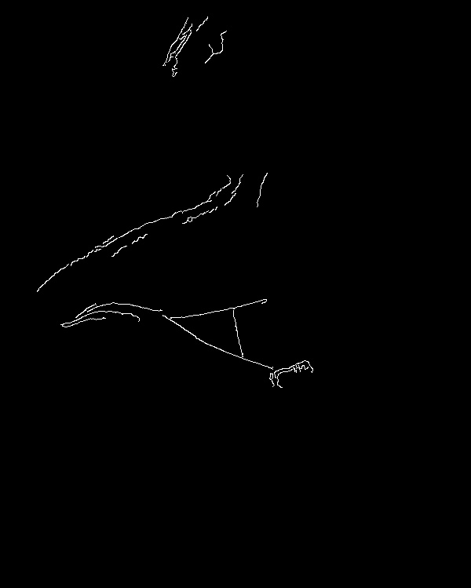
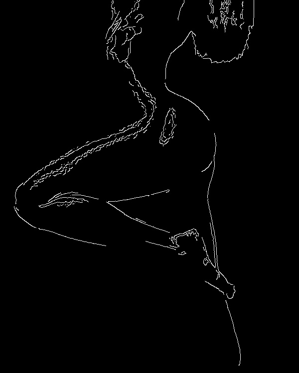

# find cany of image , use auto parameters 

1. get transaction id 
2. load image to AcapellaDB in same primary path , but in specified transaction
3. run fragment in cpvm cloud. fragment put to AcapellaDB in path linked to transaction id results images. and commit transaction.
4. Client code load from AcapellaDb result images

Original file 

| one | two |
| --- | --- |
|  | |


result, **tight** mode

| one, tight | two, tight |
| --- | --- |
| | |


result **wide** mode 

| one, wide | two, wide |
| --- | --- |
|  | |

result, **auto** mode

| one, auto | two, auto |
| --- | --- |
|  | |


```bash
$cat ./experiment.sh
```

```bash 
#!/bin/sh
# WARNING : need `jq` utility

#encode source image
b64=$(base64 -w 0 <telo.jpg)

#get transaction id   for working
TR=$(curl $(netrc) -X POST "http://api.acapella.ru:5678/acapelladb/v2/tx" 2>/dev/null |jq '.index' |tr -d \" )
echo TR = $TR

# put image to AcapellaDB (WITH  transaction)
curl $(netrc) -X PUT "http://api.acapella.ru:5678/acapelladb/v2/kv/keys/pavlovma007:temp:image?&n=3&r=2&w=2&transaction=$TR" -H  "accept: application/json" -H  "content-type: application/json" -d "'$b64'" 2>/dev/null 

# run data from AcapellaDB hanling in CPVM 
acapella run autoCany.py  --trid $TR --args {\"imgKV\":\"pavlovma007:temp:image\"}

# debug: rollback 
curl $(netrc) -X POST "http://api.acapella.ru:5678/acapelladb/v2/tx/$TR/rollback" 2>/dev/null 

#get results from AcapellaDB (NO transaction, but trid in primary key)
curl $(netrc) -X GET "http://api.acapella.ru:5678/acapelladb/v2/kv/keys/pavlovma007:temp:$TR:wide?n=3&r=2&w=2"  2>/dev/null > wide.b64
curl $(netrc) -X GET "http://api.acapella.ru:5678/acapelladb/v2/kv/keys/pavlovma007:temp:$TR:tight?n=3&r=2&w=2" 2>/dev/null > tight.b64
curl $(netrc) -X GET "http://api.acapella.ru:5678/acapelladb/v2/kv/keys/pavlovma007:temp:$TR:auto?n=3&r=2&w=2"  2>/dev/null > auto.b64
```
